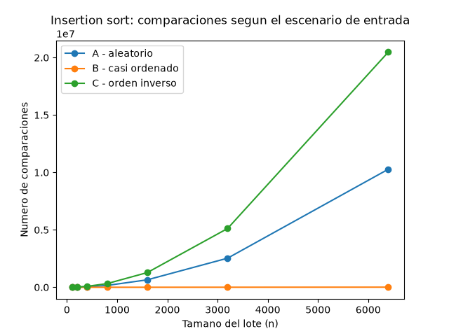
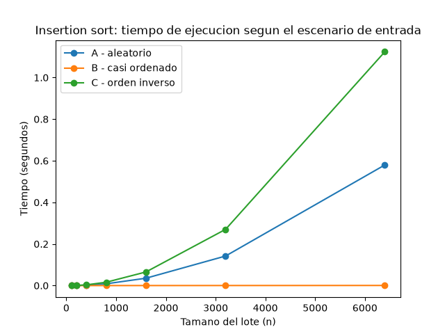
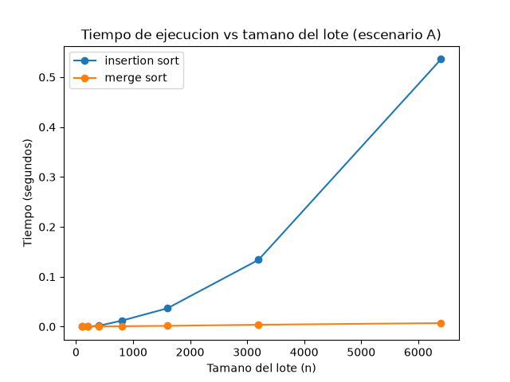

# Laboratorio evaluativo 1 — Fundamentos, complejidad y recurrencias

**Nombre:** Santiago Martínez

## Cómo reproducir el experimento

Desde la raíz del repositorio, con el entorno virtual ya creado según el Laboratorio 2:

```bash
source venv/Scripts/activate      # o venv/bin/activate en Linux/Mac
pip install -r requirements.txt
cd lab1-fundamentos-complejidad-recurrencias
python parte3_casos.py            # genera graficas/parte3_comparaciones.png y parte3_tiempo.png
python parte4_complejidad.py      # genera graficas/parte4_tiempo.png
```

Cada script imprime en consola los mismos números que se usan en las secciones de abajo, por si se quiere comparar sin volver a correrlo.

---

## Parte 1 — Analizar el algoritmo antes de comprar hardware

Que el proceso de Tamiza lleve ocho años entregando el resultado correcto no dice nada sobre si es un buen algoritmo, dice que **es correcto**: dado cualquier lote de 1.200.000 registros, insertion sort termina y entrega la lista ordenada. Eso no está en discusión. El problema es otro: **eficiencia**, es decir, cuántos recursos (en este caso, tiempo) necesita para terminar. Y la restricción concreta que se está incumpliendo es la ventana de 4 horas: el proceso puede ser perfectamente correcto y aun así no caber en el tiempo disponible, porque corrección y eficiencia son dos preguntas distintas. Un algoritmo puede tardar una hora o puede tardar un año y en ambos casos entregar la respuesta correcta.

Duplicar la velocidad del servidor no resuelve esto porque insertion sort tiene un costo que crece proporcional a n², no a n. Si el número de registros se duplicó al ampliar el programa a todo el departamento, el tiempo de ordenamiento no se duplicó: se multiplicó por cuatro (porque (2n)² = 4n²). Comprar un servidor el doble de rápido solo divide ese tiempo entre dos, así que en la práctica el proceso vuelve a quedar donde estaba antes de la ampliación, o peor, porque la cantidad de registros va a seguir creciendo y cada vez que se duplique otra vez el volumen, va a hacer falta duplicar la velocidad del hardware otra vez. Es una solución que hay que repetir cada pocos meses, mientras que cambiar el algoritmo por uno de complejidad n log n resuelve el problema de fondo una sola vez, sin importar cuánto crezca el departamento después.

Un ejemplo distinto: una universidad que revisa el plagio de los trabajos finales comparando cada entrega contra todas las demás entregas del mismo curso. Si un curso tiene 300 estudiantes, comparar cada trabajo contra los otros 299 significa del orden de 300×299 comparaciones de texto, y ese número también crece cuadráticamente si el curso crece a 600 estudiantes (ahí serían cuatro veces más comparaciones, no el doble). La universidad podría comprar un servidor más rápido para que las comparaciones de texto se hagan más rápido, pero si en unos años los cursos masivos llegan a 3000 estudiantes, el número de comparaciones no se sostiene con hardware: hay que cambiar el método (por ejemplo, usando huellas digitales de texto en vez de comparar todo contra todo) porque la restricción que se incumple no es "el procesador es lento", es que el algoritmo hace más trabajo del que el sistema puede pagar a esa escala.

---

## Parte 2 — Responsabilidad ambiental y ética

**Dimensión ambiental.** Cada minuto que el proceso de Tamiza tarda de más es CPU encendida consumiendo energía, y esto no es un gasto de una sola vez: el proceso corre todas las madrugadas, los 365 días del año, durante los años que la plataforma siga en producción (lleva 8 y nada indica que vaya a cambiar pronto). Si insertion sort tarda, por decir un número, media hora más que un algoritmo n log n en el mismo hardware, esa media hora se repite unas 365 veces al año, y otra vez el año siguiente. Elegir mal el algoritmo no es un costo ambiental puntual, es una decisión que se paga en electricidad (y en las emisiones asociadas a generarla) cada noche, indefinidamente, hasta que alguien decida corregirla.

**Dimensión ética.** Acá hay al menos dos formas concretas en que decidir mal el algoritmo perjudica a alguien identificable:

1. Si el proceso no termina dentro de la ventana de 4 horas, la lista de llamadas del día queda incompleta —de hecho ya pasó 3 veces— y eso significa que hay pacientes con riesgo cardiovascular alto que no reciben la llamada de seguimiento ese día. El costo lo asume directamente **el paciente**, que puede ser alguien que necesitaba esa llamada para ajustar un tratamiento a tiempo.
2. Si la respuesta ante el desbordamiento es "compremos un servidor más rápido" en vez de corregir el algoritmo, el costo económico recurrente (cada vez que el volumen vuelva a crecer, tocará comprar hardware otra vez) lo termina asumiendo **la Secretaría de Salud**, que paga infraestructura de más para tapar un problema que es de diseño de software, dinero que podría ir a ampliar la cobertura del programa en vez de a servidores.

Además, el orden en que queda la lista no es un detalle técnico: decide literalmente a quién se llama primero. Si el ordenamiento tiene un error o no logra terminar completo, no es que "algunos pacientes" se atrasen al azar, es que el sistema está tomando —sin que nadie lo decida explícitamente— quién queda de primero y quién de último en una lista de prioridad de riesgo cardiovascular. Eso le pone al ordenamiento una exigencia adicional que no tendría si solo estuviera ordenando, no sé, nombres de productos en un catálogo: no basta con que "generalmente" quede bien ordenado, tiene que ser exacto, porque un error de ordenamiento acá se traduce directo en que alguien de mayor riesgo quede más abajo en la lista que alguien de menor riesgo.

---

## Parte 3 — Peor caso, mejor caso y caso promedio

### 3.1 Explicación

- **Peor caso**: el máximo de comparaciones que hace el algoritmo, tomado sobre todas las entradas posibles de un tamaño n fijo. Responde "¿cuánto puede llegar a tardar, en el escenario más desfavorable?".
- **Mejor caso**: el mínimo de comparaciones, sobre el mismo conjunto de entradas de tamaño n. Responde "¿cuánto tarda como mínimo, si todo sale a favor?".
- **Caso promedio**: el promedio de comparaciones sobre todas las entradas posibles de tamaño n (asumiendo alguna distribución, típicamente que cualquier entrada es igual de probable). Responde "¿cuánto tarda normalmente?".

Para decidir si el proceso de Tamiza entra en producción usaría el **peor caso**. La ventana de 4 horas es una restricción dura, no negociable, y no se puede apostar a que el lote que llegue esa madrugada sea uno "cómodo": el canal de origen puede cambiar (portal web, reproceso, migración) y el sistema tiene que caber en la ventana sin importar cómo venga ordenado el lote. Diseñar para el caso promedio significa que hay una fracción de las madrugadas en las que el proceso simplemente no va a alcanzar a terminar, que es exactamente el problema que ya está pasando.

**Predicción antes de medir:** insertion_sort ordena de mayor a menor riesgo. El escenario C (orden inverso, de menor a mayor) es, por definición del enunciado, exactamente el contrario al que necesita Tamiza, así que debería ser el peor caso: cada elemento nuevo tiene que recorrerse toda la parte ya ordenada antes de encontrar su lugar. El escenario B (casi ordenado, 98% ya en el orden correcto) debería ser el mejor caso, porque la mayoría de los elementos ya están donde tienen que estar y casi no hay que moverlos. El escenario A (aleatorio) debería quedar entre los dos, más cerca del promedio.

### 3.2 Resultados

Código de esta parte: [`parte3_casos.py`](parte3_casos.py), que usa [`insertion_sort`](algoritmos.py) y los tres generadores de [`datos.py`](datos.py).





Con n=6400, insertion_sort hizo 10.276.753 comparaciones en el escenario A, 10.277 en el B y 20.476.800 en el C. La diferencia entre B y los otros dos escenarios no es de un múltiplo chico, es de tres órdenes de magnitud. La predicción se cumplió: el escenario C fue el peor caso en todos los tamaños medidos, y el escenario B fue el mejor por un margen enorme, tan claro que en la gráfica de comparaciones la curva de B se ve prácticamente pegada al eje horizontal comparada con A y C.

Un dato que confirma que la implementación está bien: con n=200 en el escenario C, el número de comparaciones dio exactamente 19.900, que es 200×199/2, el número de comparaciones que predice la teoría para el peor caso exacto de insertion sort. Las curvas de tiempo tienen la misma forma que las de comparaciones (como era de esperarse, porque en este algoritmo el tiempo depende directamente de cuántas comparaciones y corrimientos hace), aunque con algo de ruido en los tamaños más chicos porque ahí el tiempo medido es tan corto que empieza a pesar la variabilidad del sistema operativo.

---

## Parte 4 — Complejidad de merge sort e insertion sort

### 4.1 Cálculo teórico

**Recurrencia de merge sort.** Cada llamada a `merge_sort` sobre una lista de tamaño n hace dos llamadas recursivas sobre mitades de tamaño n/2, y después combina los dos resultados ordenados en `_mezclar`, un proceso que recorre las dos mitades una sola vez y por lo tanto cuesta Θ(n). Eso da:

$$T(n) = 2T(n/2) + \Theta(n)$$

Donde el `2T(n/2)` son las dos llamadas recursivas sobre la mitad del problema cada una, y el `Θ(n)` es el costo de combinar (la mezcla) una vez que las dos mitades ya están ordenadas.

**Resolviendo por árbol de recursión.** En el nivel 0 del árbol hay un solo nodo, el problema completo de tamaño n, con costo de combinar cn (usando c como la constante que esconde el Θ). En el nivel 1 hay 2 nodos de tamaño n/2 cada uno, con costo c(n/2) cada uno, que sumados dan otra vez cn para todo el nivel. En el nivel 2 hay 4 nodos de tamaño n/4, costo c(n/4) cada uno, y otra vez cn en total. En general, en el nivel i hay 2^i nodos de tamaño n/2^i, y el costo de ese nivel es:

$$2^i \cdot c \cdot \frac{n}{2^i} = cn$$

o sea que **cada nivel del árbol cuesta lo mismo, cn**, sin importar en qué nivel esté. La recursión llega al caso base cuando el tamaño del subproblema es 1, es decir cuando n/2^i = 1, lo que pasa en el nivel i = log₂(n). Contando desde el nivel 0, eso da log₂(n) + 1 niveles. El costo total es la suma del costo de todos los niveles:

$$T(n) = cn \cdot (\log_2 n + 1) = \Theta(n \log n)$$

**Costo de insertion_sort línea por línea.** Con `t_i` el número de veces que el ciclo `while` interno se ejecuta durante la iteración externa `i` (que va de 1 a n-1):

| Línea | Costo por ejecución | Veces que se ejecuta |
|---|---|---|
| `for i in range(1, n)` | c₁ | n |
| `actual = resultado[i]` | c₂ | n − 1 |
| `j = i - 1` | c₃ | n − 1 |
| `while j >= 0:` (evalúa la condición) | c₄ | Σ (tᵢ + 1) |
| `comparaciones += 1` | c₅ | Σ tᵢ |
| `if resultado[j] < actual:` | c₆ | Σ tᵢ |
| `resultado[j+1] = resultado[j]; j -= 1` | c₇ | Σ tᵢ' (tᵢ' ≤ tᵢ) |
| `resultado[j+1] = actual` | c₈ | n − 1 |

Todas las sumatorias van de i=1 a i=n-1. `tᵢ` puede ir desde 0 (el elemento ya está en su lugar, no hay que mover nada) hasta i (hay que compararlo contra todos los anteriores).

- **Mejor caso**: la lista ya llega en el orden que insertion_sort produce (descendente). Entonces `tᵢ = 0` para todo i: cada elemento se compara una sola vez contra el anterior y el ciclo se corta de inmediato. El costo queda dominado por los términos que se ejecutan n o n-1 veces, así que T(n) = Θ(n).
- **Peor caso**: la lista llega en orden exactamente contrario (escenario C). Ahí `tᵢ = i` para todo i, porque cada elemento nuevo tiene que correrse hasta el principio. La suma Σ tᵢ = Σ_{i=1}^{n-1} i = n(n-1)/2, que es Θ(n²).
- **Caso promedio**: en una entrada aleatoria, en promedio cada elemento nuevo tiene que correrse la mitad de lo que lleva ordenado, así que Σ tᵢ ≈ n(n-1)/4, que sigue siendo Θ(n²), solo que con una constante más chica que el peor caso.

**Tabla de complejidades:**

| Algoritmo | Mejor caso | Peor caso | Caso promedio |
|---|---|---|---|
| `insertion_sort` | Θ(n) | Θ(n²) | Θ(n²) |
| `merge_sort` | Θ(n log n) | Θ(n log n) | Θ(n log n) |

Merge sort no tiene esta variación entre casos porque siempre parte el problema por la mitad sin importar cómo vengan ordenados los datos: la división es siempre pareja, así que el costo no depende del escenario de entrada, solo de n.

### 4.2 Validación experimental

Código de esta parte: [`parte4_complejidad.py`](parte4_complejidad.py), que compara [`insertion_sort` y `merge_sort`](algoritmos.py).



Con datos del escenario A y n=6400, insertion_sort tardó en promedio 0,536 s y merge_sort 0,007 s, una diferencia de más de 75 veces a favor de merge sort, y la brecha se sigue abriendo mientras n crece: en la gráfica la curva de insertion_sort tiene la forma de parábola que se espera de Θ(n²), mientras que la de merge_sort casi ni se despega del eje horizontal en la misma escala, que es lo que se espera de Θ(n log n). En este experimento merge sort ya salió más rápido incluso desde n=100 (0,00007 s contra 0,0001 s); no se alcanza a ver el cruce donde insertion_sort le gana a merge_sort en tamaños chiquitos que a veces se menciona en teoría, seguramente porque los tamaños más chicos que se probaron (100, 200) ya son suficientes para que la ventaja asintótica de merge sort compense el costo extra de la recursión. Esto coincide con lo calculado en 4.1: insertion_sort crece cuadrático y merge_sort crece n log n, y esa diferencia de forma es justamente lo que se ve en la gráfica.

### 4.3 Concepto técnico para el equipo de ingeniería de la Secretaría de Salud

Recomiendo migrar el proceso de ordenamiento de Tamiza de insertion sort a **merge sort**. La razón principal no es solo que sea más rápido en las mediciones (lo es, por un factor de más de 75 veces con 6400 registros), sino que su complejidad Θ(n log n) no depende de cómo venga el lote de entrada. Insertion sort tiene un comportamiento muy distinto según el escenario: en nuestras pruebas, con el mismo tamaño de lote, el número de comparaciones en el peor caso fue casi 2000 veces el del mejor caso. Como el canal de origen de los datos puede cambiar sin aviso (portal web, reproceso, migración de otro sistema), no conviene depender de un algoritmo cuyo rendimiento varía tanto según de dónde vengan los datos ese día. Merge sort se comporta igual sin importar el canal, lo que evita mantener una implementación distinta para "el caso bueno" y otra para "el caso malo".

Sobre si el proceso actual cabe en la ventana de 4 horas: con insertion_sort, el tiempo medido para n=6400 en el escenario A fue de 0,536 s. Escalando por la forma cuadrática (n² multiplica por (1.200.000/6400)² ≈ 35.156 al pasar de 6400 a 1.200.000 registros), la estimación da aproximadamente 0,536 × 35.156 ≈ 18.800 s, unas **5,2 horas** solo para el ordenamiento — ya por encima de la ventana completa de 4 horas, sin contar el resto del proceso (lectura, escritura, red). Esto es coherente con lo que la Secretaría reporta: la lista quedó incompleta 3 veces recientemente. **Aclaro que esto es una extrapolación a partir de mediciones en un equipo de desarrollo, no una medición directa en el servidor de producción**, así que el número exacto puede variar, pero el orden de magnitud (varias horas, por encima del límite) debería sostenerse.

Con merge_sort, el mismo cálculo pero con crecimiento n log n da un panorama muy distinto: el tiempo medido en n=6400 fue 0,007 s, y al escalar por n log n (que crece mucho más despacio que n²) el tiempo estimado para 1.200.000 registros queda en el orden de segundos, muy por debajo de la ventana de 4 horas. Por eso, frente a la propuesta de comprar un servidor del doble de velocidad: duplicar la velocidad solo divide entre 2 un tiempo que, según nuestra medición, ya está en el orden de las 5 horas con el algoritmo actual — seguiría sin caber en la ventana. Cambiar el algoritmo, en cambio, resuelve el problema con el hardware que ya existe.

Una consideración fuera del tiempo puro: merge sort necesita memoria adicional para las listas temporales que usa al combinar (no ordena "en el mismo lugar" como insertion sort), lo cual con 1.200.000 registros de un valor entero cada uno es un costo de memoria manejable para un servidor de este tipo, pero sí hay que dimensionarlo al planear la migración. También vale la pena registrar que si en el futuro el escenario B (reproceso casi ordenado) pasara a ser el flujo dominante en vez de una excepción, insertion sort volvería a ser competitivo en ese caso puntual — pero mantener dos implementaciones distintas según el canal de origen agrega complejidad de mantenimiento que, para el ahorro que representa, no parece justificarse frente a tener una sola implementación que funciona bien en los tres escenarios.
